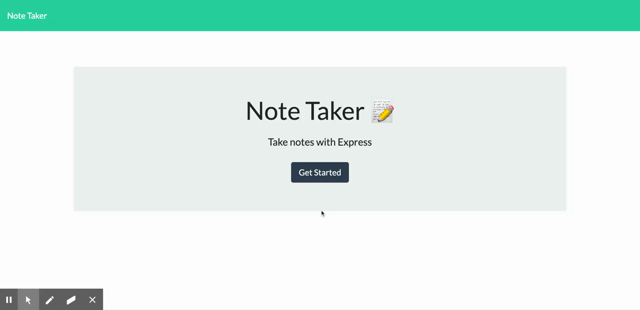

# note-pad

## Description
<br>
This application is for a user looking to be able to take notes and have them stored so when they come back they can read their notes they saved. The app is built with node.js and express.js in the back end and stores notes in a JSON file. The app alows the user to delete notes when they are no longer needed as well.

## Installation
Once you have downloaded all of the folders from this repo you can run ```npm install``` to install all of the dependencies.

## Usage
If you are running the application locally you will need to go to the directory where the files are stored and run 
```
npm start
```
to start the server.<br>



## Contributing
Contributions are always welcome. You can always submit an issue then fork the repo and make changes in the forked repo and then submit a pull request.

## Tests
Currently no tests to run but if you'd like to add some that is always welcome.

## License
  Copywrite (c) 2021 Trevor Smith

  Permission is hereby granted, free of charge, to any person obtaining a copy of this software and associated documentation files (the "Software"), to deal in the Software without restriction, including without limitation the rights to use, copy, modify, merge, publish, distribute, sublicense, and/or sell copies of the Software, and to permit persons to whom the Software is furnished to do so, subject to the following conditions:

  The above copyright notice and this permission notice shall be included in all copies or substantial portions of the Software.
  
  THE SOFTWARE IS PROVIDED "AS IS", WITHOUT WARRANTY OF ANY KIND, EXPRESS OR IMPLIED, INCLUDING BUT NOT LIMITED TO THE WARRANTIES OF MERCHANTABILITY, FITNESS FOR A PARTICULAR PURPOSE AND NONINFRINGEMENT. IN NO EVENT SHALL THE AUTHORS OR COPYRIGHT HOLDERS BE LIABLE FOR ANY CLAIM, DAMAGES OR OTHER LIABILITY, WHETHER IN AN ACTION OF CONTRACT, TORT OR OTHERWISE, ARISING FROM, OUT OF OR IN CONNECTION WITH THE SOFTWARE OR THE USE OR OTHER DEALINGS IN THE SOFTWARE.

  ## Questions
  Email: trevorsmithbanjo@gmail.com<br>
  Git Hub: https://www.github.com/trevorsmithbanjo